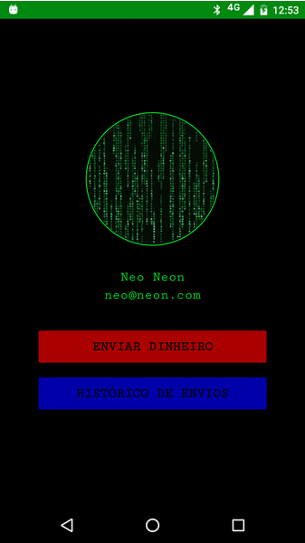

# SendMoney
An app that consumes the Neon testing API that enables the user to send money to a predefined contact and to visualize the transactions made. 

### Getting started
Clone the repository and import the project in Android Studio, you can try the app installing the `sendmoney.apk` available in the project root.

### Dependencies
The depdendencies for the project are described in the Gradle script `build.gradle` of the app, just sync the project in Android Studio and you are ready to go :)

List of third party libraries used in the project so far
- [Retrofit/OKhttp](http://square.github.io/retrofit/) - A type-safe REST client for Android and Java
- [Gson](https://github.com/google/gson) - Gson is a Java library that can be used to convert Java Objects into their JSON representation.
- [Glide](https://github.com/bumptech/glide) - Glide is a fast and efficient open source media management and image loading framework for Android that wraps media decoding, memory and disk caching, and resource pooling into a simple and easy to use interface.

### Running it
You can [build and run](https://developer.android.com/tools/building/building-studio.html) the project using the Android Studio/Gradle. You need an [android emulator](http://developer.android.com/tools/devices/emulator.html) or a [real device](http://developer.android.com/tools/device.html) to test the build.

### Screenshots

